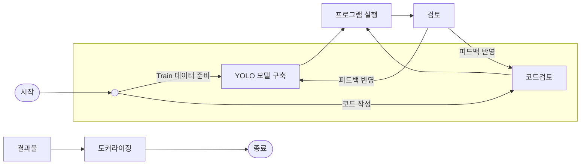
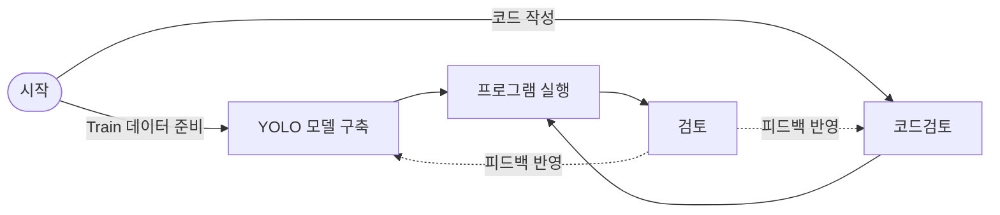

===========================

```mermaid
flowchart LR
    시작([시작])

    subgraph 초기설정 [ ]
        방향1(( )):::invisible
        방향1 -->|Train 데이터 준비| Yolo[YOLO 모델 구축]
        방향1 -->|코드 작성| 코드검토[코드검토]
    end

    시작 --> 방향1

    Yolo --> 실행[프로그램 실행]
    코드검토 --> 실행

    실행 --> 검토[검토]

    검토 -->|피드백 반영| Yolo
    검토 -->|피드백 반영| 코드검토


    결과[결과물] --> 도커[도커라이징]
    도커 --> 종료([종료])

```

===========================

```mermaid
flowchart LR
    시작([시작])
    시작 -->|Train 데이터 준비| Yolo[YOLO 모델 구축]
    시작 -->|코드 작성| 코드검토[코드검토]

    Yolo --> 실행[프로그램 실행]
    코드검토 --> 실행

    실행 --> 검토[검토]

    검토 -.->|피드백 반영| 코드검토
    검토 -.->|피드백 반영| Yolo

```
